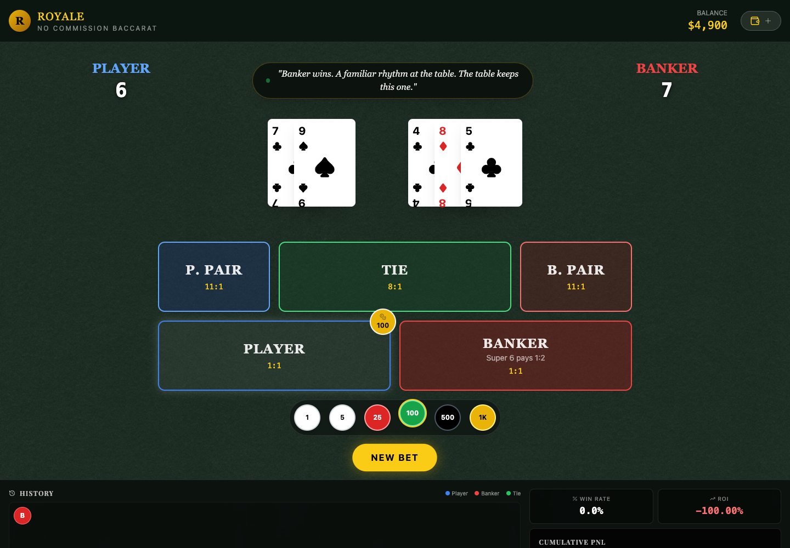

# Royale Baccarat Simulator

A polished, **free no-commission Baccarat simulator** for learning table rules,
testing betting ideas, and watching a simulated bankroll evolve—without an
account, backend, API key, or real money.

**[Play Royale Baccarat →](https://royale-baccarat.pages.dev/)**

**Project status:** active



## What you can do

- Play complete hands with natural 8/9 and standard third-card drawing rules.
- Bet on Player, Banker, Tie, Player Pair, and Banker Pair.
- Practice the no-commission Banker **Super 6** half-pay variation.
- Follow the running balance, profit/loss chart, win rate, ROI, and hand history.
- Use a simulated cashier to reset or segment practice sessions.
- Read instant local dealer commentary after each result.

## Privacy and security

Royale Baccarat runs entirely in the browser. It has no authentication, analytics,
database, network AI call, or embedded API credential. Session state is temporary
and disappears when the page reloads.

## Run locally

Requirements: Node.js 20+ and pnpm 10.

```bash
pnpm install --frozen-lockfile
pnpm dev
```

Open the local URL printed by Vite.

## Build and preview

```bash
pnpm typecheck
pnpm build
pnpm preview
```

Cloudflare Pages settings:

- Build command: `pnpm build`
- Build output directory: `dist`
- Root directory: `/`

## Data and recovery

- There is no persistent application data to back up.
- `node_modules/` and `dist/` are generated and safe to delete.
- Restore a working copy with `pnpm install --frozen-lockfile && pnpm build`.

## Responsible-use notice

This project is an educational game simulator. It does not accept deposits, place
wagers, predict outcomes, improve the mathematical house edge, or provide gambling
or financial advice. Baccarat outcomes remain games of chance; if gambling stops
being fun, stop and seek support available in your country.

## License

[MIT](LICENSE)
